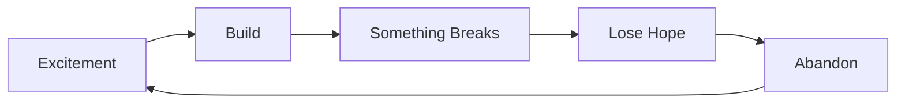
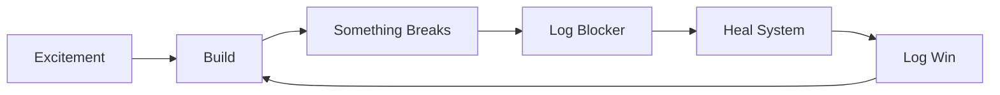

# 🧠 Brain System - Master Documentation

**Version**: 2.0 (Simplified & Working)  
**Location**: `/Users/tarive/brain-poc/`  
**Purpose**: Goal tracking + Memory system that prevents project abandonment

---

## 🚀 Quick Start (Do This First!)

```bash
# Add to your shell (if not already done)
echo "source /Users/tarive/brain-poc/brain_core.sh" >> ~/.zshrc
source ~/.zshrc

# Start your day
bstart  # Shows goals, loads context, tells you what to focus on
```

---

## 📖 Core Philosophy

**This system is built to solve YOUR specific problem:**
- You get excited about projects → Start building → Something breaks → Lose hope → Abandon → Repeat

**The Brain System breaks this cycle by:**
1. Tracking commitment (not just excitement)
2. Logging wins for dopamine rewards
3. Handling blockers WITHOUT letting you quit
4. Self-healing when things break

---

## 🎮 Daily Commands (Use These!)

### Essential Commands (Memorize These)

| Command | What it does | When to use |
|---------|--------------|-------------|
| `bstart` | Start your day routine | Every morning |
| `b` | Check brain status | Anytime |
| `w "description"` | Log a win | Made ANY progress |
| `bl "description"` | Log a blocker | Something broke |
| `bh` | Heal the system | When ANYTHING fails |
| `c "thought"` | Capture a memory | Important thoughts |
| `f "search"` | Find memories | Need to recall |

### Example Daily Flow

```bash
# Morning
bstart                           # Start your day
w "Started working on brain"     # Log first win

# When making progress
w "Fixed the search function"    # Celebrate!
c "SQLite indexes are faster"    # Capture insight

# When stuck
bl "Tests failing"               # Don't quit!
bh                              # Try healing
ub                              # Mark as resolved
w "Fixed the tests!"            # Victory!

# Throughout day
f "SQLite"                      # Search memories
b                              # Check status

# End of day
save_session                    # Save context
```

---

## 🏗️ System Architecture

### Three Integrated Systems

```
1. Goal Keeper (goal_keeper.py)
   ├── Tracks projects and excitement
   ├── Logs wins and blockers
   └── Prevents abandonment

2. Simple Brain (simple_brain.py)
   ├── Stores memories (append-only, no conflicts)
   ├── Handles concurrent sessions
   └── Fast search with SQLite

3. Working Memory (poc_scoring.py)
   ├── 7-item limit (cognitive science)
   ├── Importance scoring
   └── Temporal decay
```

### File Structure

```
/Users/tarive/brain-poc/
├── BRAIN_MASTER.md          # This file
├── brain_core.sh            # Shell integration
├── goal_keeper.py           # Anti-abandonment system
├── simple_brain.py          # Memory storage
├── scripts/
│   ├── poc_scoring.py       # Working memory
│   └── unified_brain.py     # Bridge to Basic Memory
├── working-memory/          # Current session memory
├── active_goals.json        # Your commitments
├── wins_log.json           # Victory history
└── ~/.brain/               # Simple brain storage
    ├── memory.log          # Append-only log
    ├── search.db           # SQLite index
    └── sessions/           # Session isolation
```

---

## 🔧 Troubleshooting Guide

### Common Issues & Fixes

#### 1. "Command not found" errors
```bash
# Fix: Reload shell integration
source /Users/tarive/brain-poc/brain_core.sh

# Or add permanently
echo "source /Users/tarive/brain-poc/brain_core.sh" >> ~/.zshrc
```

#### 2. "Permission denied" errors
```bash
# Fix: Make everything executable
bh  # Auto-heals permissions

# Or manually
chmod +x /Users/tarive/brain-poc/*.py
chmod +x /Users/tarive/brain-poc/*.sh
```

#### 3. "Module not found" or Python errors
```bash
# Fix: Check Python path
which python3

# Ensure using correct Python
/usr/bin/python3 /Users/tarive/brain-poc/goal_keeper.py check
```

#### 4. Working memory full (7/7 items)
```bash
# This is by design! Cognitive limit
# Old items auto-removed by importance
```

#### 5. Search not finding results
```bash
# Check memory log exists
cat ~/.brain/memory.log | tail -10

# Rebuild search index
rm ~/.brain/search.db
f "test"  # Will rebuild
```

#### 6. Concurrent session conflicts
```bash
# Already handled! Each session isolated
ls ~/.brain/sessions/  # See all sessions
```

#### 7. System completely broken
```bash
# Nuclear option - reset goals only
mv /Users/tarive/brain-poc/active_goals.json /Users/tarive/brain-poc/active_goals.backup
bh  # Heal system
w "Recovered from failure!"  # Log the win!
```

---

## 📋 Best Practices

### DO's ✅

1. **Log wins immediately** - Even tiny ones!
   ```bash
   w "Fixed a typo"  # Still counts!
   ```

2. **Log blockers instead of quitting**
   ```bash
   bl "Can't figure out SQLite"  # Document it
   bh                            # Try healing
   ```

3. **Use simple fixes first**
   ```bash
   bh  # Heals 90% of issues
   ```

4. **Capture insights immediately**
   ```bash
   c "Append-only prevents race conditions"
   ```

5. **Check status when feeling lost**
   ```bash
   b  # Shows what to focus on
   ```

### DON'Ts ❌

1. **Don't abandon when blocked**
   - Use `bl` to log it
   - Use `bh` to heal
   - Simplify instead of rebuilding

2. **Don't overcomplicate**
   - This system is intentionally simple
   - If tempted to add features, log a win instead

3. **Don't delete logs**
   - `~/.brain/memory.log` is append-only
   - Old sessions in `~/.brain/sessions/` can stay

4. **Don't ignore the commitment**
   - Check `/Users/tarive/brain-poc/commitment.json`
   - Your promise: Don't abandon this project

---

## 🎯 Goal Tracking System

### Understanding Your Pattern



### How Brain Breaks the Cycle



### Excitement Management

- **Level 10**: 🔥🔥🔥🔥🔥🔥🔥🔥🔥🔥 (New project)
- **Level 7+**: 🟢 Keep going!
- **Level 4-6**: 🟡 Need a win soon
- **Level 1-3**: 🔴 Commitment mode (push through!)

**Key Insight**: Commitment > Excitement

---

## 🔄 Integration Points

### With Obsidian (YES, Everything Syncs!)

**Automatic Sync:**
- Every `w` command syncs wins to Obsidian
- `save_session` syncs everything
- Daily summaries created automatically

**What Gets Saved to Obsidian:**
```
/Saksham/brain-system/
├── active-goals.md          # Your commitments & excitement
├── 2025-09-11-brain-summary.md  # Daily summary
├── wins/                    # Every win logged
│   ├── 2025-09-11-win-0.md
│   └── 2025-09-11-win-1.md
├── memories/                # Recent memories
│   └── 2025-09-11-memories.md
└── blockers/               # Problems you're solving
```

**Manual Sync:**
```bash
python3 /Users/tarive/brain-poc/obsidian_sync.py
```

### With Basic Memory
```bash
# Basic Memory stores long-term
basic-memory tool search-notes "query"

# Brain stores working memory
f "query"
```

### With Claude Sessions
```bash
# Hooks auto-capture activity
~/.claude/hooks/session_start.py   # Loads context
~/.claude/hooks/post_tool_use.py   # Captures tools
~/.claude/hooks/session_end.py     # Saves session
```

---

## 🚨 Emergency Procedures

### If you feel like quitting:

1. **Run this immediately:**
   ```bash
   bl "Feeling like quitting because X"
   b  # See your commitment days
   ```

2. **Remember your wins:**
   ```bash
   cat /Users/tarive/brain-poc/wins_log.json | grep WIN
   ```

3. **Simplify the problem:**
   - Don't rebuild from scratch
   - Fix just ONE small thing
   - Log it as a win

### If everything is broken:

```bash
# The recovery sequence
bh                    # Heal system
b                     # Check status
w "Recovered!"        # Log the recovery
```

---

## 📊 Metrics That Matter

| Metric | Command | What it means |
|--------|---------|---------------|
| Days committed | `b` | How long you've stuck with it |
| Win streak | `cat wins_log.json \| wc -l` | Total wins |
| Blockers resolved | Check `active_goals.json` | Problems overcome |
| Excitement level | `b` | Current motivation (less important than commitment) |

---

## 🎉 Celebrating Wins

### Quick Win Ideas (When You Need One)

- Fix a typo: `w "Fixed typo in documentation"`
- Add a comment: `w "Added helpful comment"`
- Run a test: `w "Ran tests successfully"`
- Read code: `w "Understood how X works"`
- Ask for help: `w "Asked for help instead of quitting"`

**Remember**: Small wins count! The goal is maintaining momentum, not perfection.

---

## 💪 The Commitment

Your commitment (stored in `/Users/tarive/brain-poc/commitment.json`):

> "I will NOT abandon the brain project when things break. I will simplify, not rebuild."

**Minimum commitment**: 30 days  
**Current streak**: Check with `b`  
**Fallback plan**: When blocked, simplify instead of abandoning

---

## 📝 Quick Reference Card

```bash
# DAILY ESSENTIALS
bstart          # Morning routine
b               # Check status
w "win"         # Log progress
bl "blocker"    # Log problem
bh              # Fix issues

# MEMORY
c "capture"     # Store thought
f "find"        # Search
save_session    # Save context
load_session    # Load context

# RECOVERY
bh              # Heal system
ub              # Unblock
```

---

## 🚀 Next Steps

1. **Right now**: Run `w "Read the master documentation"`
2. **Today**: Use `w` at least 3 times
3. **This week**: Don't abandon when something breaks
4. **This month**: Build a 30-day streak

---

## 📞 Getting Help

When stuck:
1. First try: `bh` (heals most issues)
2. Then: `bl "specific issue"` (documents it)
3. Then: Simplify the problem
4. Finally: Ask for help (and log it as a win!)

---

**Remember**: This system is designed to keep you committed to THIS project. Every command reinforces the habit of pushing through instead of abandoning.

**Your next command should be**: `w "Set up brain master documentation"`

---

*Generated: November 11, 2025*  
*Brain System v2.0 - The one that actually works*