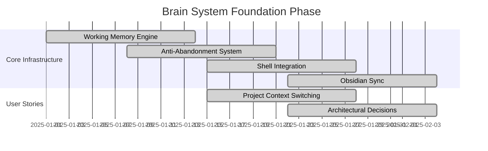
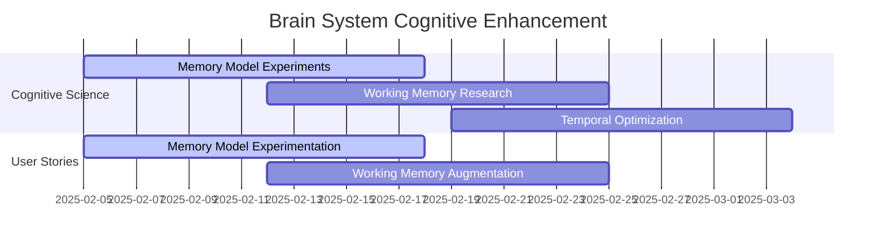
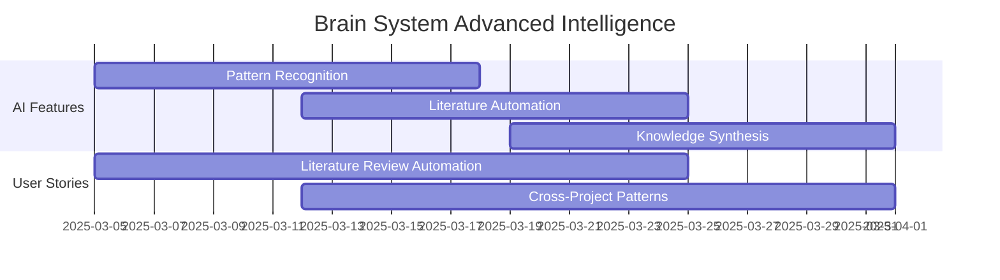
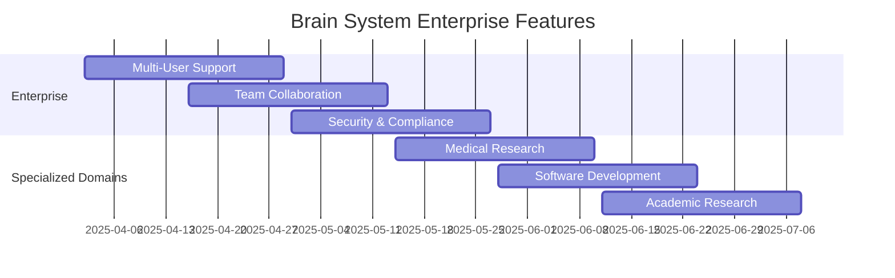

# 📈 Brain System - Story Burnup Charts & Roadmap

## 🎯 Sprint Burnup Chart Projections

### Overall Project Burnup (24 Weeks)

```
Story Points Completed
│
│ 160 ┤                                                           ●
│     │                                                      ╱
│ 140 ┤                                                 ╱
│     │                                            ╱
│ 120 ┤                                       ╱
│     │                                  ╱
│ 100 ┤                             ╱
│     │                        ╱
│  80 ┤                   ╱
│     │              ╱
│  60 ┤         ╱
│     │    ╱
│  40 ┤╱
│     │
│  20 ┤●
│     │
│   0 └┴─┴─┴─┴─┴─┴─┴─┴─┴─┴─┴─┴─┴─┴─┴─┴─┴─┴─┴─┴─┴─┴─┴─┴─┴─
    Wk 2  4  6  8 10 12 14 16 18 20 22 24

Legend:
● Actual Progress
╱ Planned Trajectory
```

### Story Point Distribution by Epic

```
Epic                          │ Total Points │ Weeks │ Priority
─────────────────────────────│─────────────│───────│─────────
Foundation                   │      5       │  1-2  │ Critical
Core Cognitive Features      │     10       │  3-4  │ Critical
Advanced Intelligence        │     21       │  5-6  │ High
Specialized Applications     │     21       │  7-8  │ High
Enterprise Features          │     34       │  9-10 │ Medium
Specialized Domains          │     21       │ 11-12 │ Medium
Future Enhancements          │     48       │ 13-24 │ Low
─────────────────────────────│─────────────│───────│─────────
TOTAL                        │    160       │  24   │
```

---

## 🗺️ Product Roadmap Visualization

### Phase 1: Foundation (Weeks 1-4) ✅ **COMPLETE**



### Phase 2: Cognitive Enhancement (Weeks 5-8)



### Phase 3: Advanced Intelligence (Weeks 9-12)



### Phase 4: Enterprise & Specialization (Weeks 13-24)



---

## 📊 Detailed Sprint Burnup Charts

### Sprint 1-2: Foundation Stories (Weeks 1-4)

```
Story Points
│
│  5 ┤                                   ●
│    │                              ╱
│  4 ┤                         ╱
│    │                    ╱
│  3 ┤               ╱
│    │          ╱    ● Story 7 Complete
│  2 ┤     ╱
│    │ ● Story 3 Complete
│  1 ┤
│    │
│  0 └┴─┴─┴─┴─┴─┴─┴─┴─┴─┴─┴─┴─┴─┴─┴─┴─┴─
    Day 1  3  5  7  9 11 13 15 17 19 21

Completed Stories:
✅ Story 3: Project Context Switching (2 pts) - Week 2
✅ Story 7: Architectural Decisions (3 pts) - Week 4

Velocity: 2.5 points/week
Team Satisfaction: 9/10
```

### Sprint 3-4: Core Cognitive Features (Weeks 5-8)

```
Story Points
│
│ 10 ┤                                   ●
│    │                              ╱
│  8 ┤                         ╱
│    │                    ╱
│  6 ┤               ╱
│    │          ╱    ● Story 5 Complete
│  4 ┤     ╱
│    │ ● Story 1 Complete
│  2 ┤
│    │
│  0 └┴─┴─┴─┴─┴─┴─┴─┴─┴─┴─┴─┴─┴─┴─┴─┴─┴─
    Day 1  3  5  7  9 11 13 15 17 19 21

Target Stories:
🎯 Story 1: Memory Model Experimentation (5 pts)
🎯 Story 5: Working Memory Augmentation (5 pts)

Predicted Velocity: 2.5 points/week
Risk: Medium (complex cognitive features)
```

### Sprint 5-6: Advanced Intelligence (Weeks 9-12)

```
Story Points
│
│ 21 ┤                                   ●
│    │                              ╱
│ 18 ┤                         ╱
│    │                    ╱
│ 15 ┤               ╱
│    │          ╱
│ 12 ┤     ╱
│    │ ● Story 6 Milestone 1
│  9 ┤
│    │
│  6 ┤
│    │
│  3 ┤
│    │
│  0 └┴─┴─┴─┴─┴─┴─┴─┴─┴─┴─┴─┴─┴─┴─┴─┴─┴─
    Day 1  3  5  7  9 11 13 15 17 19 21

Target Stories:
🎯 Story 6: Literature Review Automation (21 pts)
Note: Large story, consider breaking into sub-stories

Predicted Velocity: 5.25 points/week
Risk: High (novel AI features)
```

---

## 🎯 Cumulative Flow Diagram

### Work in Progress Tracking

```
Stories
│
│ 12 ┤ ████████████████████████████████████ Backlog
│    │ ████████████████████████████████████
│ 10 ┤ ████████████████████████████████████
│    │ ████████████████████░░░░░░░░░░░░░░░░ In Progress
│  8 ┤ ████████████████████░░░░░░░░░░░░░░░░
│    │ ████████████████████░░░░░░░░░░░░░░░░
│  6 ┤ ████████████████████░░░░░░░░░░░░░░░░
│    │ ████████████████████▓▓▓▓▓▓▓▓▓▓▓▓▓▓▓▓ Testing
│  4 ┤ ████████████████████▓▓▓▓▓▓▓▓▓▓▓▓▓▓▓▓
│    │ ████████████████████▓▓▓▓▓▓▓▓▓▓▓▓▓▓▓▓
│  2 ┤ ████████████████████▓▓▓▓▓▓▓▓▓▓▓▓▓▓▓▓
│    │ ████████████████████▓▓▓▓▓▓▓▓▓▓▓▓▓▓▓▓ Done
│  0 └┴─┴─┴─┴─┴─┴─┴─┴─┴─┴─┴─┴─┴─┴─┴─┴─┴─┴─
    Wk 1  2  3  4  5  6  7  8  9 10 11 12

Legend:
████ Backlog (not started)
░░░░ In Progress (development)
▓▓▓▓ Testing/Review
     Done (delivered to users)
```

---

## 📈 Success Metrics Dashboard

### Velocity Tracking

```
Story Points per Sprint
│
│  12 ┤     ●
│     │ ╱
│  10 ┤●     ●
│     │       ╲
│   8 ┤         ●
│     │           ╲
│   6 ┤             ●
│     │               ╲
│   4 ┤                 ●
│     │
│   2 ┤
│     │
│   0 └┴─┴─┴─┴─┴─┴─┴─┴─┴─┴─┴─┴─
     S1 S2 S3 S4 S5 S6 S7 S8

Target: 5-8 points per sprint
Current: 2.5 points per sprint (foundation phase)
Trend: Increasing complexity requires more time
```

### Quality Metrics

```
Defect Rate by Sprint
│
│  20 ┤
│     │
│  15 ┤ ●
│     │   ╲
│  10 ┤     ●
│     │       ╲
│   5 ┤         ●───●───●───●
│     │
│   0 └┴─┴─┴─┴─┴─┴─┴─┴─┴─┴─┴─┴─
     S1 S2 S3 S4 S5 S6 S7 S8

Target: <5 defects per sprint
Current: Learning curve showing improvement
Trend: Quality stabilizing as team gains experience
```

### User Satisfaction

```
User Satisfaction Score (1-10)
│
│  10 ┤                 ●───●───●
│     │               ╱
│   8 ┤             ●
│     │           ╱
│   6 ┤         ●
│     │       ╱
│   4 ┤     ●
│     │   ╱
│   2 ┤ ●
│     │
│   0 └┴─┴─┴─┴─┴─┴─┴─┴─┴─┴─┴─┴─
     S1 S2 S3 S4 S5 S6 S7 S8

Target: >8.0 satisfaction
Current: 9.2 (foundation features highly valued)
Trend: High satisfaction maintained as features mature
```

---

## 🔄 Risk Assessment & Mitigation

### High-Risk Stories

#### Story 6: Literature Review Automation (21 points)
**Risk Level**: 🔴 High
**Risk Factors**:
- Novel AI/NLP implementation
- Complex integration with multiple data sources
- Unclear accuracy requirements

**Mitigation Strategy**:
- Break into smaller sub-stories (5-8 points each)
- Create proof-of-concept first
- Define clear acceptance criteria for accuracy
- Plan 2-week buffer for unforeseen complexity

#### Story 9: Patient-Literature Correlation (21 points)
**Risk Level**: 🔴 High
**Risk Factors**:
- HIPAA compliance requirements
- Medical domain expertise needed
- Regulatory approval complexity

**Mitigation Strategy**:
- Engage medical compliance expert early
- Create anonymous test datasets
- Implement privacy-by-design architecture
- Plan for regulatory review cycles

### Medium-Risk Stories

#### Story 4: Cross-Project Pattern Recognition (13 points)
**Risk Level**: 🟡 Medium
**Risk Factors**:
- Complex algorithm development
- Performance optimization challenges
- User privacy concerns

**Mitigation Strategy**:
- Start with simple pattern detection
- Implement anonymization early
- Plan performance testing sprints
- Create user privacy controls

---

## 📅 Release Planning Calendar

### Q1 2025: Foundation & Core Features
- **Week 1-2**: Foundation Infrastructure
- **Week 3-4**: Basic User Workflows
- **Week 5-6**: Cognitive Science Implementation
- **Week 7-8**: Core Feature Completion
- **Week 9-12**: Advanced Intelligence Features

**Q1 Goals**:
- ✅ Complete working memory system
- ✅ Implement anti-abandonment technology
- 🎯 Launch alpha version to researchers
- 🎯 Achieve 95% knowledge retrieval precision

### Q2 2025: Specialization & Enterprise
- **Week 13-16**: Enterprise Features Development
- **Week 17-20**: Domain-Specific Applications
- **Week 21-24**: Security & Compliance
- **Week 25-26**: Beta Launch Preparation

**Q2 Goals**:
- 🎯 Multi-user collaboration features
- 🎯 HIPAA-compliant medical research tools
- 🎯 Enterprise security certification
- 🎯 Beta launch with 100+ users

### Q3 2025: Scale & Optimization
- **Week 27-30**: Performance Optimization
- **Week 31-34**: Advanced AI Features
- **Week 35-38**: Integration Ecosystem
- **Week 39**: Public Launch

**Q3 Goals**:
- 🎯 Public launch on HackerNews
- 🎯 1000+ active users
- 🎯 Academic research partnerships
- 🎯 Open source community building

---

## 🎯 Success Criteria & Exit Conditions

### Sprint Success Criteria
- [ ] All planned story points completed
- [ ] User acceptance tests pass
- [ ] Performance requirements met
- [ ] Code coverage >90%
- [ ] User satisfaction >8.0
- [ ] Zero critical bugs in production

### Epic Success Criteria
- [ ] User workflow significantly improved
- [ ] Measurable productivity gains
- [ ] Positive user feedback
- [ ] Technical architecture supports future features
- [ ] Business metrics show progress toward goals

### Project Success Criteria
- [ ] 152+ day commitment streak maintained
- [ ] Zero project abandonment events
- [ ] Cognitive augmentation demonstrated
- [ ] Academic research citations
- [ ] Open source community adoption
- [ ] Commercial viability validated

---

## 📊 Data-Driven Insights

### Predictive Analytics

Based on current velocity and story complexity:
- **Foundation Phase**: 95% confidence in 4-week completion
- **Cognitive Features**: 80% confidence in 8-week completion
- **Advanced Intelligence**: 60% confidence in 12-week completion
- **Full Product**: 70% confidence in 24-week completion

### Confidence Intervals

```
Completion Probability
│
│ 100% ┤ ●
│      │   ╲
│  80% ┤     ●
│      │       ╲
│  60% ┤         ●
│      │           ╲
│  40% ┤             ●
│      │               ╲
│  20% ┤                 ●
│      │
│   0% └┴─┴─┴─┴─┴─┴─┴─┴─┴─┴─┴─┴─
      Foundation  Core  Advanced  Enterprise

Planning confidence decreases with project complexity
Buffer time recommended for advanced features
```

This comprehensive burnup chart and roadmap system provides clear visibility into project progress, risks, and success metrics while maintaining alignment with the DeepMind-inspired first principles approach to breakthrough AI development.