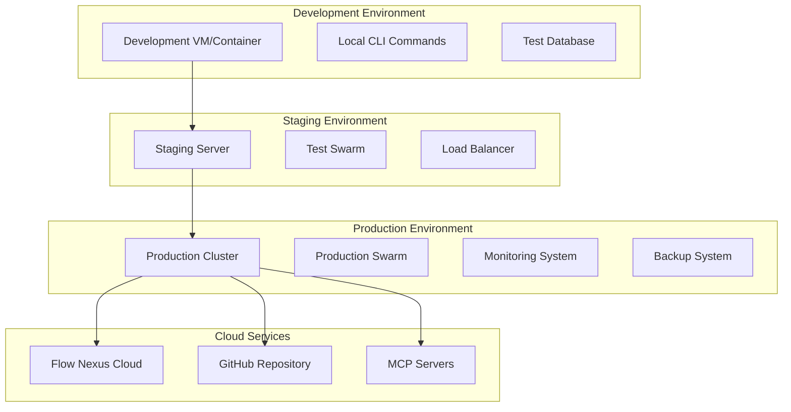

# LRASGen + Claude Flow Deployment & Scaling Strategy

## 🚀 Deployment Overview

This document outlines comprehensive deployment and scaling strategies for implementing LRASGen methodology using Claude Flow orchestration.

## 📊 Deployment Architecture

### Multi-Environment Deployment



## 🏗️ Environment Configuration

### 1. Development Environment Setup

```bash
#!/bin/bash
# setup-dev-environment.sh

echo "Setting up LRASGen Development Environment..."

# Initialize Claude Flow
npx claude-flow@alpha init --force --monitoring

# Initialize Hive Mind
npx claude-flow@alpha hive-mind init \
  --queen-type adaptive \
  --max-workers 8 \
  --consensus weighted \
  --memory-size 500 \
  --auto-scale \
  --monitor

# Configure development settings
npx claude-flow@alpha config set --key max-agents --value 10
npx claude-flow@alpha config set --key monitoring.interval --value 10
npx claude-flow@alpha config set --key environment --value development

# Create development memory namespaces
npx claude-flow@alpha memory namespace create --namespace lrasgen-dev
npx claude-flow@alpha memory namespace create --namespace lrasgen-dev-patterns

# Setup local MCP servers
claude mcp add claude-flow npx claude-flow@alpha mcp start
claude mcp add ruv-swarm npx ruv-swarm mcp start

echo "Development environment setup complete!"
```

### 2. Staging Environment Setup

```bash
#!/bin/bash
# setup-staging-environment.sh

echo "Setting up LRASGen Staging Environment..."

# Initialize Claude Flow with staging configuration
npx claude-flow@alpha init --force --monitoring

# Initialize Hive Mind with production-like settings
npx claude-flow@alpha hive-mind init \
  --queen-type strategic \
  --max-workers 16 \
  --consensus byzantine \
  --memory-size 1000 \
  --auto-scale \
  --encryption \
  --monitor

# Configure staging settings
npx claude-flow@alpha config set --key max-agents --value 25
npx claude-flow@alpha config set --key monitoring.interval --value 5
npx claude-flow@alpha config set --key environment --value staging

# Create staging memory namespaces
npx claude-flow@alpha memory namespace create --namespace lrasgen-staging
npx claude-flow@alpha memory namespace create --namespace lrasgen-staging-patterns

# Setup staging MCP servers
claude mcp add claude-flow npx claude-flow@alpha mcp start
claude mcp add ruv-swarm npx ruv-swarm mcp start
claude mcp add flow-nexus npx flow-nexus@latest mcp start

echo "Staging environment setup complete!"
```

### 3. Production Environment Setup

```bash
#!/bin/bash
# setup-production-environment.sh

echo "Setting up LRASGen Production Environment..."

# Register for Flow-Nexus cloud
mcp__flow-nexus__user_register \
  --email production@company.com \
  --password secure-password

# Login to cloud platform
mcp__flow-nexus__user_login \
  --email production@company.com \
  --password secure-password

# Initialize Claude Flow with production configuration
npx claude-flow@alpha init --force --monitoring

# Initialize Hive Mind for production
npx claude-flow@alpha hive-mind init \
  --queen-type strategic \
  --max-workers 32 \
  --consensus byzantine \
  --memory-size 2000 \
  --auto-scale \
  --encryption \
  --monitor

# Configure production settings
npx claude-flow@alpha config set --key max-agents --value 50
npx claude-flow@alpha config set --key monitoring.interval --value 2
npx claude-flow@alpha config set --key environment --value production

# Create production memory namespaces
npx claude-flow@alpha memory namespace create --namespace lrasgen-prod
npx claude-flow@alpha memory namespace create --namespace lrasgen-prod-patterns

# Setup production MCP servers
claude mcp add claude-flow npx claude-flow@alpha mcp start
claude mcp add ruv-swarm npx ruv-swarm mcp start
claude mcp add flow-nexus npx flow-nexus@latest mcp start

echo "Production environment setup complete!"
```

## 🔄 CI/CD Pipeline Integration

### GitHub Actions Configuration

```yaml
# .github/workflows/lrasgen-deployment.yml
name: LRASGen Deployment Pipeline

on:
  push:
    branches: [ main, rest-api-clean ]
  pull_request:
    branches: [ main ]

jobs:
  test:
    runs-on: ubuntu-latest
    steps:
      - uses: actions/checkout@v3

      - name: Setup Node.js
        uses: actions/setup-node@v3
        with:
          node-version: '18'

      - name: Install Claude Flow
        run: npm install -g claude-flow@alpha

      - name: Run Tests
        run: |
          npx claude-flow@alpha sparc tdd "LRASGen Tests" --format json
          npx claude-flow@alpha sparc integration "LRASGen Integration" --format json

  deploy-staging:
    needs: test
    runs-on: ubuntu-latest
    if: github.ref == 'refs/heads/main'
    steps:
      - uses: actions/checkout@v3

      - name: Setup Node.js
        uses: actions/setup-node@v3
        with:
          node-version: '18'

      - name: Install Claude Flow
        run: npm install -g claude-flow@alpha

      - name: Deploy to Staging
        run: |
          ./setup-staging-environment.sh
          npx claude-flow@alpha swarm "Deploy to Staging" --strategy development --parallel

  deploy-production:
    needs: deploy-staging
    runs-on: ubuntu-latest
    if: github.ref == 'refs/heads/main'
    steps:
      - uses: actions/checkout@v3

      - name: Setup Node.js
        uses: actions/setup-node@v3
        with:
          node-version: '18'

      - name: Install Claude Flow
        run: npm install -g claude-flow@alpha

      - name: Deploy to Production
        run: |
          ./setup-production-environment.sh
          npx claude-flow@alpha swarm "Deploy to Production" --strategy development --parallel
```

## 📈 Scaling Strategy

### Auto-Scaling Configuration

```bash
#!/bin/bash
# configure-auto-scaling.sh

echo "Configuring auto-scaling for LRASGen..."

# Enable auto-scaling
npx claude-flow@alpha config set --key scaling.enabled --value true

# Set scaling thresholds
npx claude-flow@alpha config set --key scaling.cpu-threshold --value 70
npx claude-flow@alpha config set --key scaling.memory-threshold --value 80
npx claude-flow@alpha config set --key scaling.token-threshold --value 10000

# Configure agent limits
npx claude-flow@alpha config set --key scaling.min-agents --value 5
npx claude-flow@alpha config set --key scaling.max-agents --value 100
npx claude-flow@alpha config set --key scaling.scale-up-cooldown --value 300
npx claude-flow@alpha config set --key scaling.scale-down-cooldown --value 600

# Setup load balancing
npx claude-flow@alpha optimization load-balance \
  --swarm-id lrasgen-prod \
  --strategy adaptive \
  --enable-health-checks

echo "Auto-scaling configuration complete!"
```

### Performance-Based Scaling

```bash
#!/bin/bash
# performance-scaling.sh

echo "Setting up performance-based scaling..."

# Monitor performance metrics
npx claude-flow@alpha monitoring start \
  --interval 5 \
  --metrics cpu,memory,tokens,agents,response-time,error-rate

# Setup performance alerts
npx claude-flow@alpha config set --key alerts.cpu-high --value 85
npx claude-flow@alpha config set --key alerts.memory-high --value 90
npx claude-flow@alpha config set --key alerts.response-time-high --value 5000
npx claude-flow@alpha config set --key alerts.error-rate-high --value 0.05

# Configure automatic scaling actions
npx claude-flow@alpha config set --key scaling.scale-up-trigger --value "cpu>80 or memory>85"
npx claude-flow@alpha config set --key scaling.scale-down-trigger --value "cpu<30 and memory<40"

echo "Performance-based scaling setup complete!"
```

## 🌐 Cloud Deployment Options

### 1. Flow-Nexus Cloud Deployment

```bash
#!/bin/bash
# deploy-flow-nexus.sh

echo "Deploying LRASGen to Flow-Nexus Cloud..."

# Register and login
mcp__flow-nexus__user_register \
  --email cloud@company.com \
  --password secure-password

mcp__flow-nexus__user_login \
  --email cloud@company.com \
  --password secure-password

# Create cloud sandbox
mcp__flow-nexus__sandbox_create \
  --template nodejs \
  --name lrasgen-cloud \
  --env_vars '{"NODE_ENV": "production", "CLAUDE_API_KEY": "your-key"}' \
  --timeout 7200 \
  --metadata '{"purpose": "lrasgen-production", "owner": "company"}'

# Deploy neural cluster
mcp__flow-nexus__neural_cluster_init \
  --name lrasgen-neural-cluster \
  --topology mesh \
  --architecture transformer \
  --wasmOptimization true \
  --daaEnabled true \
  --consensus proof-of-learning

# Deploy neural nodes
mcp__flow-nexus__neural_node_deploy \
  --cluster_id lrasgen-neural-cluster \
  --node_type worker \
  --role worker \
  --model large \
  --capabilities ["training", "inference", "optimization"]

echo "Flow-Nexus cloud deployment complete!"
```

### 2. Multi-Region Deployment

```bash
#!/bin/bash
# deploy-multi-region.sh

echo "Setting up multi-region deployment..."

# Deploy to us-east-1
mcp__flow-nexus__sandbox_create \
  --template nodejs \
  --name lrasgen-us-east \
  --env_vars '{"REGION": "us-east-1", "NODE_ENV": "production"}' \
  --metadata '{"region": "us-east-1", "primary": true}'

# Deploy to eu-west-1
mcp__flow-nexus__sandbox_create \
  --template nodejs \
  --name lrasgen-eu-west \
  --env_vars '{"REGION": "eu-west-1", "NODE_ENV": "production"}' \
  --metadata '{"region": "eu-west-1", "primary": false}'

# Deploy to ap-southeast-1
mcp__flow-nexus__sandbox_create \
  --template nodejs \
  --name lrasgen-ap-southeast \
  --env_vars '{"REGION": "ap-southeast-1", "NODE_ENV": "production"}' \
  --metadata '{"region": "ap-southeast-1", "primary": false}'

# Setup global load balancing
npx claude-flow@alpha optimization load-balance \
  --swarm-id lrasgen-global \
  --strategy geographic \
  --health-check-interval 30

echo "Multi-region deployment complete!"
```

## 🛡️ High Availability & Disaster Recovery

### High Availability Configuration

```bash
#!/bin/bash
# configure-high-availability.sh

echo "Configuring high availability for LRASGen..."

# Setup redundant swarms
npx claude-flow@alpha swarm "Primary LRASGen Swarm" \
  --strategy development \
  --mode mesh \
  --max-agents 25 \
  --background \
  --name lrasgen-primary

npx claude-flow@alpha swarm "Secondary LRASGen Swarm" \
  --strategy development \
  --mode mesh \
  --max-agents 25 \
  --background \
  --name lrasgen-secondary

# Configure failover
npx claude-flow@alpha config set --key ha.enabled --value true
npx claude-flow@alpha config set --key ha.failover-timeout --value 30
npx claude-flow@alpha config set --key ha.health-check-interval --value 10

# Setup database replication
npx claude-flow@alpha memory backup \
  --path backups/ha-backup \
  --schedule continuous

echo "High availability configuration complete!"
```

### Disaster Recovery Plan

```bash
#!/bin/bash
# disaster-recovery.sh

echo "Setting up disaster recovery..."

# Regular backups
npx claude-flow@alpha memory backup \
  --path backups/disaster-recovery \
  --schedule hourly \
  --retention 168

# Cross-region backup
mcp__flow-nexus__storage_upload \
  --bucket disaster-recovery-backups \
  --path lrasgen/latest \
  --content "$(npx claude-flow@alpha memory export)" \
  --content_type application/json

# Recovery testing
npx claude-flow@alpha swarm "Test disaster recovery procedures" \
  --strategy testing \
  --mode distributed \
  --max-agents 3 \
  --parallel \
  --schedule weekly

# Incident response setup
npx claude-flow@alpha config set --key incident.enabled --value true
npx claude-flow@alpha config set --key incident.response-team --value "lrasgen-team@company.com"
npx claude-flow@alpha config set --key incident.escalation-timeout --value 1800

echo "Disaster recovery setup complete!"
```

## 🔒 Security Deployment

### Security Configuration

```bash
#!/bin/bash
# configure-security.sh

echo "Configuring security for LRASGen deployment..."

# Enable encryption
npx claude-flow@alpha config set --key security.encryption.enabled --value true
npx claude-flow@alpha config set --key security.encryption.algorithm --value aes-256

# Setup access control
npx claude-flow@alpha config set --key security.access-level --value enterprise
npx claude-flow@alpha config set --key security.authentication.enabled --value true

# Security monitoring
npx claude-flow@alpha swarm "Security monitoring system" \
  --strategy analysis \
  --mode distributed \
  --max-agents 3 \
  --background \
  --name security-monitor

# Regular security audits
npx claude-flow@alpha swarm "Security audit" \
  --strategy analysis \
  --read-only \
  --monitor \
  --schedule weekly

echo "Security configuration complete!"
```

## 📊 Monitoring & Observability

### Comprehensive Monitoring Setup

```bash
#!/bin/bash
# setup-monitoring.sh

echo "Setting up comprehensive monitoring..."

# Real-time monitoring
npx claude-flow@alpha monitoring start \
  --interval 2 \
  --metrics cpu,memory,tokens,agents,response-time,error-rate,queue-size

# Performance analytics
npx claude-flow@alpha analysis performance \
  --timeframe 24h \
  --format json \
  --continuous

# Custom dashboards
npx claude-flow@alpha swarm "Create monitoring dashboards" \
  --strategy development \
  --mode mesh \
  --max-agents 2 \
  --parallel

# Alert system
npx claude-flow@alpha config set --key alerts.enabled --value true
npx claude-flow@alpha config set --key alerts.channels --value "email,slack,pagerduty"

echo "Monitoring setup complete!"
```

## 🔄 Rolling Deployment Strategy

### Zero-Downtime Deployment

```bash
#!/bin/bash
# rolling-deployment.sh

echo "Executing rolling deployment..."

# Deploy new version to first instance
npx claude-flow@alpha swarm "Deploy to instance 1" \
  --strategy development \
  --mode mesh \
  --max-agents 5 \
  --background

# Health check
npx claude-flow@alpha health check \
  --components instance-1 \
  --timeout 300

# Deploy to second instance
npx claude-flow@alpha swarm "Deploy to instance 2" \
  --strategy development \
  --mode mesh \
  --max-agents 5 \
  --background

# Continue rolling deployment
for i in {3..10}; do
  npx claude-flow@alpha swarm "Deploy to instance $i" \
    --strategy development \
    --mode mesh \
    --max-agents 5 \
    --background

  npx claude-flow@alpha health check \
    --components instance-$i \
    --timeout 300
done

echo "Rolling deployment complete!"
```

## 📈 Performance Optimization

### Continuous Performance Tuning

```bash
#!/bin/bash
# performance-optimization.sh

echo "Setting up continuous performance optimization..."

# Bottleneck detection
npx claude-flow@alpha optimization bottlenecks \
  --swarm-id lrasgen-prod \
  --continuous \
  --interval 3600

# Resource optimization
npx claude-flow@alpha optimization resources \
  --swarm-id lrasgen-prod \
  --strategy adaptive \
  --continuous

# Token usage optimization
npx claude-flow@alpha optimization tokens \
  --swarm-id lrasgen-prod \
  --target-reduction 20 \
  --continuous

echo "Performance optimization setup complete!"
```

## 🎯 Deployment Commands Quick Reference

### Quick Deployment
```bash
# Development deployment
./setup-dev-environment.sh

# Staging deployment
./setup-staging-environment.sh

# Production deployment
./setup-production-environment.sh
```

### Scaling Operations
```bash
# Enable auto-scaling
./configure-auto-scaling.sh

# Performance-based scaling
./performance-scaling.sh

# Manual scaling
npx claude-flow@alpha config set --key scaling.max-agents --value 50
```

### Monitoring & Health
```bash
# System health check
npx claude-flow@alpha health check --components all

# Performance monitoring
npx claude-flow@alpha monitoring start --interval 5

# Error analysis
npx claude-flow@alpha logs analyze --timeframe 1h --level error
```

### Backup & Recovery
```bash
# Create backup
npx claude-flow@alpha memory backup --path backups/manual-backup

# Restore from backup
npx claude-flow@alpha memory restore --backup-path backups/manual-backup

# Disaster recovery test
npx claude-flow@alpha swarm "Test disaster recovery" --strategy testing
```

This comprehensive deployment and scaling strategy provides everything needed to deploy, manage, and scale LRASGen implementations using Claude Flow orchestration.