# LRASGen + Claude Flow Integration - Mermaid Workflow Diagrams

## 🌊 System Architecture Overview

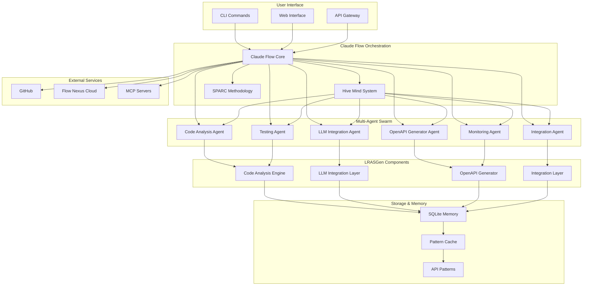

## 🔄 Implementation Workflow

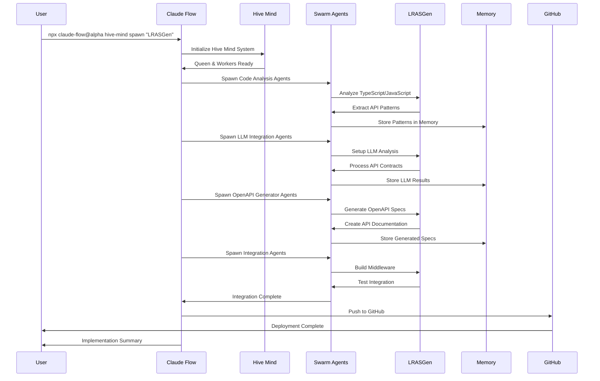

## 🐝 Hive Mind Coordination Flow

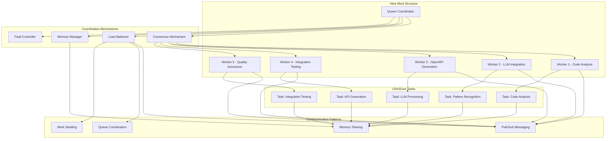

## 📊 SPARC Methodology Implementation

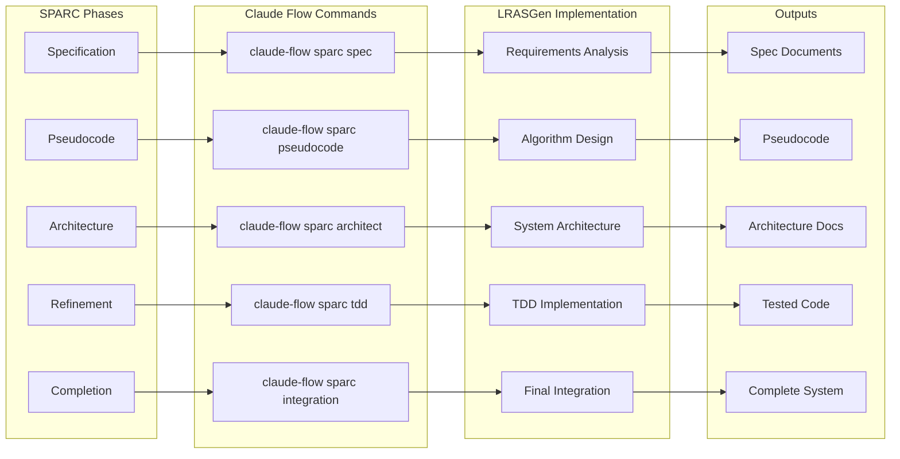

## 🚀 Deployment Pipeline

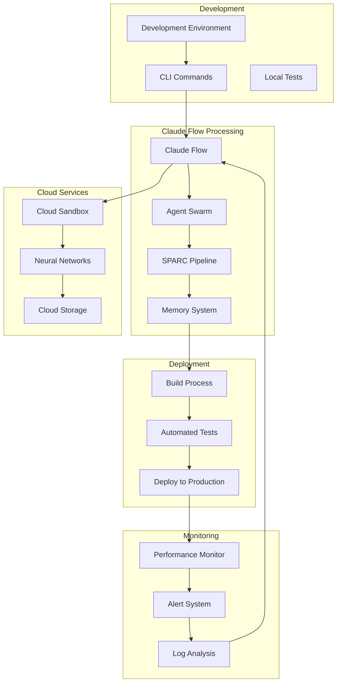

## 🔄 Data Flow Architecture

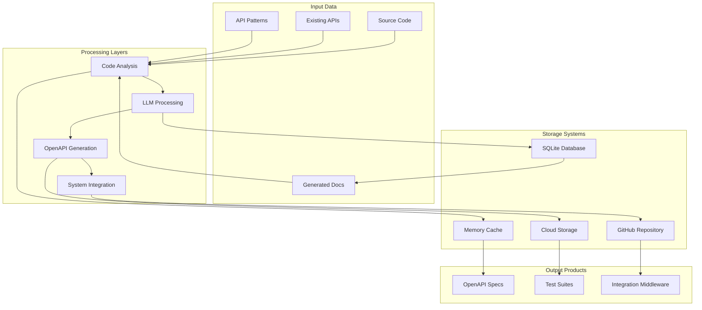

## 📈 Performance Monitoring Flow

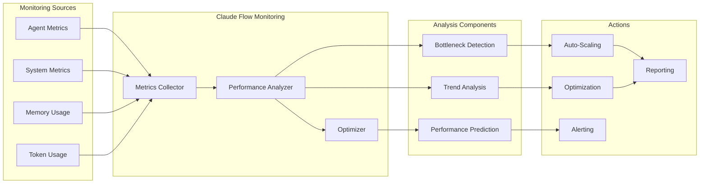

## 🔐 Security Architecture

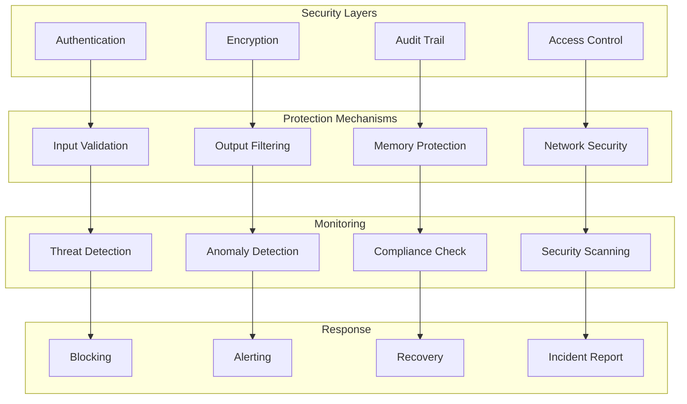

## 🛡️ Fault Tolerance & Recovery

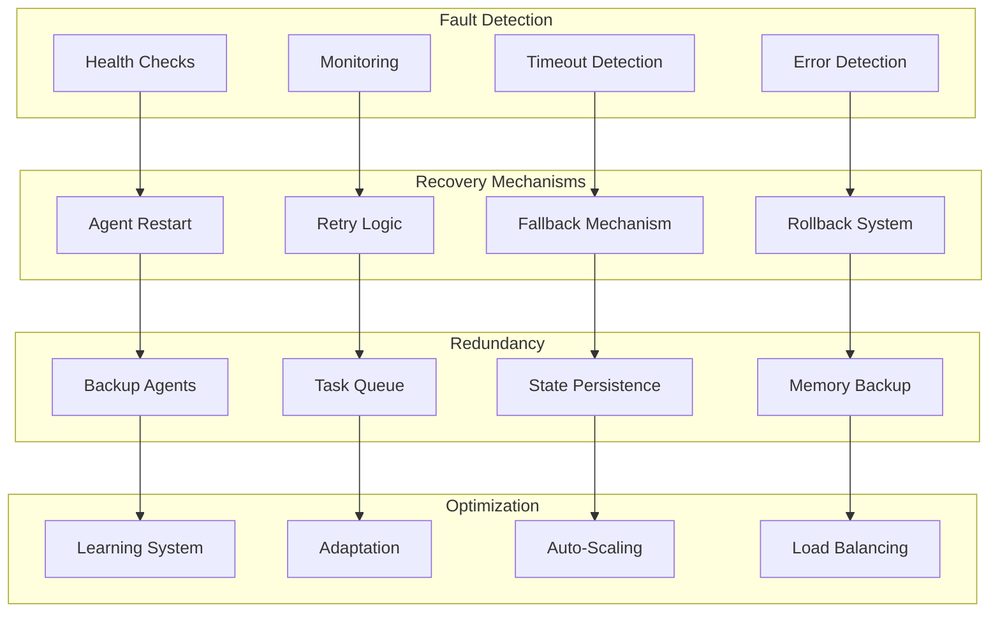

## 🎯 Command Execution Flow

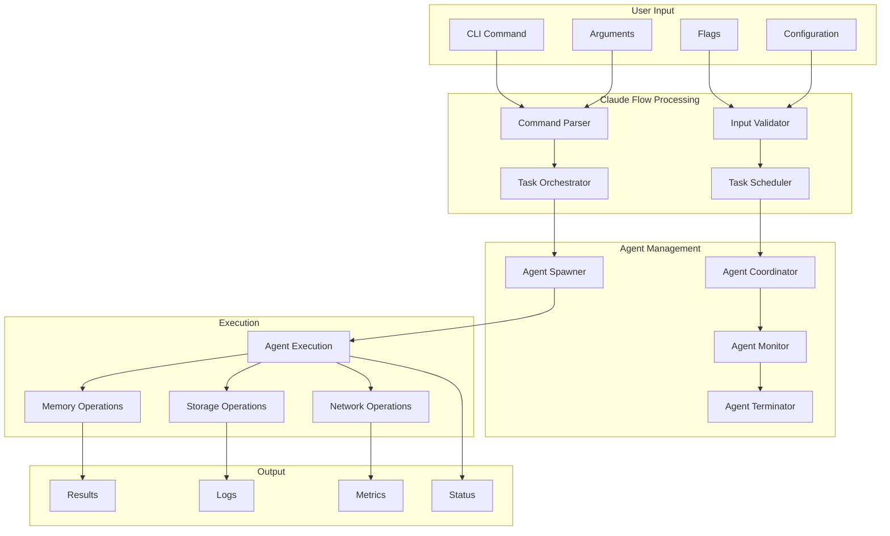

## 📊 Resource Allocation Flow

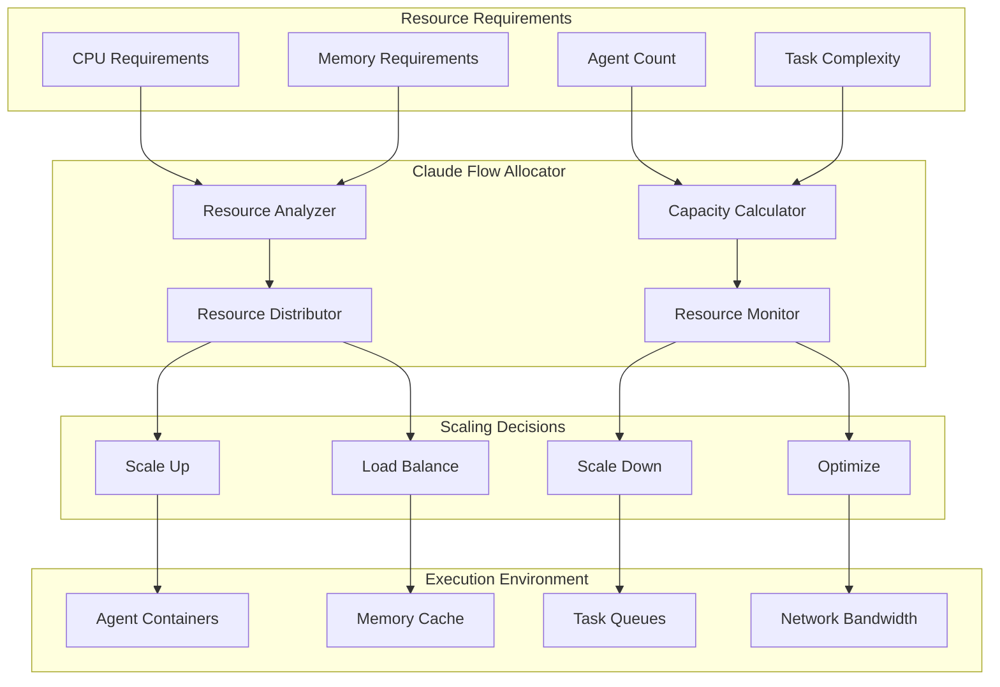

These Mermaid charts provide a comprehensive visualization of the LRASGen and Claude Flow integration architecture, showing how components interact, data flows, and the overall system behavior.