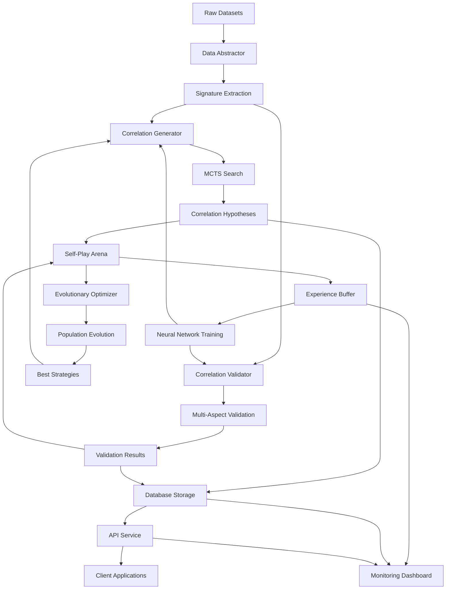

# Ever-Expanding Dataset System: Complete Architecture

## System Overview

The Ever-Expanding Dataset (EED) system is a self-improving AI platform that discovers correlations between datasets without explicit programming. It uses adversarial self-play between a Generator and Validator network, similar to AlphaZero's approach to game mastery, but applied to data relationship discovery.

## Core Architecture Components

### 1. Abstract Data Representation Engine

The system converts any dataset into domain-agnostic representations that capture statistical, semantic, and structural properties.

```python
class DataSignature:
    """Universal data representation for correlation discovery."""

    def __init__(self, dataset_id: str):
        self.dataset_id = dataset_id
        self.statistical = StatisticalSignature()
        self.semantic = SemanticSignature()
        self.structural = StructuralSignature()
        self.temporal = TemporalSignature()
        self.spatial = SpatialSignature()
```

#### Statistical Signature Components
- **Distribution Profiles**: Moments, quantiles, entropy measures
- **Cardinality Analysis**: Unique values, null patterns, outlier detection
- **Correlation Matrices**: Internal variable relationships
- **Information Metrics**: Mutual information, conditional entropy

#### Semantic Signature Components
- **Column Embeddings**: BERT/GPT encodings of field names
- **Value Embeddings**: Sample data encoded via transformers
- **Context Vectors**: Table/dataset level semantic meaning
- **Ontology Mappings**: Connection to knowledge graphs

#### Structural Signature Components
- **Schema Graphs**: Tables as nodes, relationships as edges
- **Constraint Networks**: Keys, indices, data dependencies
- **Hierarchy Detection**: Parent-child, many-to-many patterns
- **Topology Analysis**: Graph properties, clustering coefficients

### 2. Neural Architecture

#### Correlation Generator Network

```python
class CorrelationGenerator(nn.Module):
    """Proposes correlations between abstract representations."""

    def __init__(self, config: GeneratorConfig):
        super().__init__()
        self.encoder = TransformerEncoder(
            d_model=config.d_model,
            n_heads=config.n_heads,
            n_layers=config.n_layers
        )
        self.cross_attention = MultiHeadCrossAttention(
            d_model=config.d_model,
            n_heads=config.n_heads
        )
        self.correlation_classifier = nn.Sequential(
            nn.Linear(config.d_model * 2, config.d_hidden),
            nn.ReLU(),
            nn.Dropout(config.dropout),
            nn.Linear(config.d_hidden, config.n_correlation_types)
        )
        self.parameter_generator = ParameterGenerator(config)

    def forward(
        self,
        source_signature: DataSignature,
        target_signature: DataSignature,
        context: Optional[CorrelationContext] = None
    ) -> CorrelationHypothesis:
        # Encode signatures
        source_encoding = self.encoder(source_signature)
        target_encoding = self.encoder(target_signature)

        # Cross-attention to find relationships
        correlation_features = self.cross_attention(
            source_encoding,
            target_encoding
        )

        # Classify correlation type
        correlation_type = self.correlation_classifier(correlation_features)

        # Generate correlation parameters
        parameters = self.parameter_generator(
            correlation_features,
            correlation_type
        )

        return CorrelationHypothesis(
            type=correlation_type,
            parameters=parameters,
            confidence=self.compute_confidence(correlation_features)
        )
```

#### Validator Network

```python
class CorrelationValidator(nn.Module):
    """Challenges and validates proposed correlations."""

    def __init__(self, config: ValidatorConfig):
        super().__init__()
        self.statistical_validator = StatisticalValidator(config)
        self.semantic_validator = SemanticValidator(config)
        self.structural_validator = StructuralValidator(config)
        self.conservation_checker = ConservationLawChecker(config)
        self.ensemble = ValidatorEnsemble(config)

    def forward(
        self,
        hypothesis: CorrelationHypothesis,
        data_samples: DataSamples
    ) -> ValidationResult:
        # Multi-aspect validation
        stat_result = self.statistical_validator(hypothesis, data_samples)
        sem_result = self.semantic_validator(hypothesis, data_samples)
        struct_result = self.structural_validator(hypothesis, data_samples)
        conserve_result = self.conservation_checker(hypothesis, data_samples)

        # Ensemble decision
        final_validity = self.ensemble(
            [stat_result, sem_result, struct_result, conserve_result]
        )

        # Generate counter-examples if invalid
        counter_examples = None
        if final_validity.score < 0.5:
            counter_examples = self.generate_counter_examples(
                hypothesis,
                data_samples
            )

        return ValidationResult(
            validity_score=final_validity.score,
            component_scores={
                'statistical': stat_result.score,
                'semantic': sem_result.score,
                'structural': struct_result.score,
                'conservation': conserve_result.score
            },
            failure_modes=final_validity.failure_modes,
            counter_examples=counter_examples
        )
```

### 3. Self-Play Training System

#### Monte Carlo Tree Search for Correlation Discovery

```python
class CorrelationMCTS:
    """MCTS for intelligent correlation exploration."""

    def __init__(self, config: MCTSConfig):
        self.config = config
        self.policy_network = PolicyNetwork(config)
        self.value_network = ValueNetwork(config)
        self.tree = CorrelationSearchTree()

    def search(
        self,
        root_state: CorrelationState,
        n_simulations: int
    ) -> CorrelationPath:
        for _ in range(n_simulations):
            # Selection
            leaf = self.select(root_state)

            # Expansion
            if not leaf.is_terminal():
                child = self.expand(leaf)
                leaf = child

            # Simulation
            value = self.simulate(leaf)

            # Backpropagation
            self.backpropagate(leaf, value)

        return self.get_best_path()

    def select(self, node: CorrelationNode) -> CorrelationNode:
        """UCB-based selection with neural guidance."""
        while not node.is_leaf():
            # Get policy network prior
            prior = self.policy_network(node.state)

            # UCB calculation with neural prior
            best_child = max(
                node.children,
                key=lambda c: c.Q + self.config.c_puct * prior[c.action] *
                             sqrt(node.N) / (1 + c.N)
            )
            node = best_child

        return node
```

#### Self-Play Training Loop

```python
class SelfPlayTrainer:
    """Orchestrates adversarial self-play training."""

    def __init__(self, config: TrainingConfig):
        self.generator = CorrelationGenerator(config.generator_config)
        self.validator = CorrelationValidator(config.validator_config)
        self.mcts = CorrelationMCTS(config.mcts_config)
        self.experience_buffer = ExperienceReplayBuffer(
            capacity=config.buffer_size
        )
        self.optimizer_g = Adam(self.generator.parameters())
        self.optimizer_v = Adam(self.validator.parameters())

    def self_play_episode(
        self,
        source_data: Dataset,
        target_data: Dataset
    ) -> Episode:
        episode = Episode()
        state = CorrelationState(source_data, target_data)

        while not state.is_terminal():
            # Generator proposes via MCTS
            with torch.no_grad():
                correlation_path = self.mcts.search(state, n_simulations=800)
                correlation = correlation_path.best_correlation()

            # Validator evaluates
            validation = self.validator(correlation, state.get_samples())

            # Calculate rewards
            generator_reward = self.calculate_generator_reward(
                correlation,
                validation
            )
            validator_reward = self.calculate_validator_reward(
                correlation,
                validation
            )

            # Store experience
            experience = Experience(
                state=state,
                correlation=correlation,
                validation=validation,
                g_reward=generator_reward,
                v_reward=validator_reward
            )
            episode.add(experience)
            self.experience_buffer.add(experience)

            # Update state
            state = state.apply(correlation, validation)

        return episode

    def train_from_experience(self, batch_size: int = 32):
        """Train networks from replay buffer."""
        if len(self.experience_buffer) < batch_size:
            return

        batch = self.experience_buffer.sample(batch_size)

        # Update Generator
        g_loss = self.generator_loss(batch)
        self.optimizer_g.zero_grad()
        g_loss.backward()
        self.optimizer_g.step()

        # Update Validator
        v_loss = self.validator_loss(batch)
        self.optimizer_v.zero_grad()
        v_loss.backward()
        self.optimizer_v.step()
```

### 4. Evolutionary Optimization Layer

#### Genetic Programming for Correlation Functions

```python
class EvolutionaryCorrelationOptimizer:
    """Evolves correlation discovery strategies."""

    def __init__(self, config: EvolutionConfig):
        self.population_size = config.population_size
        self.mutation_rate = config.mutation_rate
        self.crossover_rate = config.crossover_rate
        self.tournament_size = config.tournament_size
        self.population = self.initialize_population()

    def evolve_correlation_function(
        self,
        source_data: Dataset,
        target_data: Dataset,
        generations: int = 100
    ) -> CorrelationFunction:
        for generation in range(generations):
            # Evaluate fitness
            fitness_scores = self.evaluate_population(
                source_data,
                target_data
            )

            # Selection
            parents = self.tournament_selection(fitness_scores)

            # Crossover
            offspring = self.crossover(parents)

            # Mutation
            offspring = self.mutate(offspring)

            # Environmental selection
            self.population = self.environmental_selection(
                self.population + offspring,
                fitness_scores
            )

            # Adaptive parameter control
            self.adapt_parameters(generation, fitness_scores)

        return self.get_best_individual()

    def create_correlation_tree(self) -> CorrelationTree:
        """Generate tree-based correlation function."""
        primitives = {
            'binary': [np.add, np.multiply, np.divide, np.subtract],
            'unary': [np.log1p, np.sqrt, np.square, np.tanh],
            'aggregations': [np.mean, np.sum, np.std, np.median],
            'transformations': [fft, wavelet_transform, pca]
        }

        return self.random_tree(primitives, max_depth=5)
```

#### CMA-ES for Continuous Parameter Optimization

```python
class CMAESCorrelationTuner:
    """Covariance Matrix Adaptation Evolution Strategy for fine-tuning."""

    def __init__(self, config: CMAESConfig):
        self.es = cma.CMAEvolutionStrategy(
            config.initial_params,
            config.initial_sigma,
            {
                'popsize': config.population_size,
                'maxiter': config.max_iterations,
                'verb_disp': 0
            }
        )

    def optimize_correlation_parameters(
        self,
        correlation_template: CorrelationTemplate,
        validation_data: ValidationSet
    ) -> OptimizedParameters:
        def objective(params):
            correlation = correlation_template.instantiate(params)
            validation_result = validate_correlation(
                correlation,
                validation_data
            )
            # Minimize negative validity score
            return -validation_result.validity_score

        while not self.es.stop():
            solutions = self.es.ask()
            fitness_list = [objective(x) for x in solutions]
            self.es.tell(solutions, fitness_list)

        best_params = self.es.result.xbest
        return OptimizedParameters(best_params)
```

### 5. Information-Theoretic Discovery

#### Mutual Information Maximization

```python
class MutualInformationDiscovery:
    """Discovers correlations via information theory."""

    def __init__(self, config: MIConfig):
        self.mine = MINE(
            alpha=config.alpha,
            c=config.c,
            est=config.estimator
        )
        self.hsic = HSICIndependenceTest(
            kernel_x=config.kernel_x,
            kernel_y=config.kernel_y
        )

    def discover_nonlinear_correlations(
        self,
        X: np.ndarray,
        Y: np.ndarray
    ) -> CorrelationMatrix:
        # Maximal Information Coefficient
        mic_matrix = self.compute_mic_matrix(X, Y)

        # Hilbert-Schmidt Independence Criterion
        hsic_matrix = self.compute_hsic_matrix(X, Y)

        # Transfer Entropy for directional relationships
        te_matrix = self.compute_transfer_entropy(X, Y)

        # Combine measures
        correlation_matrix = self.ensemble_measures(
            mic_matrix,
            hsic_matrix,
            te_matrix
        )

        return self.extract_significant_correlations(correlation_matrix)
```

### 6. Database Integration Layer

#### Correlation Discovery Database

```python
class CorrelationDiscoveryDB:
    """Persistent storage for correlation discovery system."""

    def __init__(self, db_path: str = 'correlations.db'):
        self.engine = create_engine(f'sqlite:///{db_path}')
        Base.metadata.create_all(self.engine)
        self.Session = sessionmaker(bind=self.engine)

    def create_schema(self):
        """Create optimized schema for correlation storage."""
        with self.engine.connect() as conn:
            conn.execute(text('''
                -- Discovered correlations with versioning
                CREATE TABLE correlations (
                    id UUID PRIMARY KEY DEFAULT gen_random_uuid(),
                    source_dataset_id VARCHAR(255) NOT NULL,
                    target_dataset_id VARCHAR(255) NOT NULL,
                    correlation_type VARCHAR(100) NOT NULL,
                    parameters JSONB NOT NULL,
                    confidence FLOAT NOT NULL,
                    discovered_at TIMESTAMP DEFAULT CURRENT_TIMESTAMP,
                    version INTEGER DEFAULT 1,
                    parent_correlation_id UUID REFERENCES correlations(id),

                    -- Indexes for performance
                    INDEX idx_source_target (source_dataset_id, target_dataset_id),
                    INDEX idx_confidence (confidence DESC),
                    INDEX idx_discovered_at (discovered_at DESC),
                    INDEX idx_correlation_type (correlation_type)
                );

                -- Validation results with detailed metrics
                CREATE TABLE validations (
                    id UUID PRIMARY KEY DEFAULT gen_random_uuid(),
                    correlation_id UUID REFERENCES correlations(id),
                    validity_score FLOAT NOT NULL,
                    statistical_score FLOAT,
                    semantic_score FLOAT,
                    structural_score FLOAT,
                    conservation_error FLOAT,
                    test_accuracy FLOAT,
                    counter_examples JSONB,
                    validated_at TIMESTAMP DEFAULT CURRENT_TIMESTAMP,

                    INDEX idx_correlation_validity (correlation_id, validity_score)
                );

                -- Experience replay buffer for training
                CREATE TABLE experiences (
                    id UUID PRIMARY KEY DEFAULT gen_random_uuid(),
                    episode_id UUID NOT NULL,
                    step_number INTEGER NOT NULL,
                    state JSONB NOT NULL,
                    action JSONB NOT NULL,
                    reward FLOAT NOT NULL,
                    next_state JSONB NOT NULL,
                    done BOOLEAN DEFAULT FALSE,
                    priority FLOAT DEFAULT 1.0,
                    created_at TIMESTAMP DEFAULT CURRENT_TIMESTAMP,

                    INDEX idx_episode (episode_id, step_number),
                    INDEX idx_priority (priority DESC)
                );

                -- Dataset signatures cache
                CREATE TABLE dataset_signatures (
                    dataset_id VARCHAR(255) PRIMARY KEY,
                    statistical_signature JSONB NOT NULL,
                    semantic_signature JSONB NOT NULL,
                    structural_signature JSONB NOT NULL,
                    temporal_signature JSONB,
                    spatial_signature JSONB,
                    computed_at TIMESTAMP DEFAULT CURRENT_TIMESTAMP,
                    expires_at TIMESTAMP,

                    INDEX idx_expires (expires_at)
                );

                -- Evolutionary population tracking
                CREATE TABLE evolution_population (
                    id UUID PRIMARY KEY DEFAULT gen_random_uuid(),
                    generation INTEGER NOT NULL,
                    individual_id UUID NOT NULL,
                    genome JSONB NOT NULL,
                    fitness FLOAT NOT NULL,
                    parent1_id UUID,
                    parent2_id UUID,
                    mutation_info JSONB,
                    created_at TIMESTAMP DEFAULT CURRENT_TIMESTAMP,

                    INDEX idx_generation_fitness (generation, fitness DESC)
                );

                -- Performance metrics for monitoring
                CREATE TABLE performance_metrics (
                    id UUID PRIMARY KEY DEFAULT gen_random_uuid(),
                    metric_type VARCHAR(100) NOT NULL,
                    metric_value FLOAT NOT NULL,
                    metadata JSONB,
                    recorded_at TIMESTAMP DEFAULT CURRENT_TIMESTAMP,

                    INDEX idx_metric_type_time (metric_type, recorded_at DESC)
                );
            '''))
```

### 7. Geographic Correlation Specialization

#### ZCTA-MSA Discovery Module

```python
class GeographicCorrelationDiscovery:
    """Specialized module for geographic data correlations."""

    def __init__(self, config: GeoConfig):
        self.spatial_analyzer = SpatialAnalyzer(config)
        self.crosswalk_detector = CrosswalkDetector(config)
        self.weight_discoverer = WeightDiscoverer(config)

    def discover_geographic_relationships(
        self,
        source_geo: gpd.GeoDataFrame,
        target_geo: gpd.GeoDataFrame,
        auxiliary_data: Optional[pd.DataFrame] = None
    ) -> GeographicCorrelation:
        # Detect spatial relationships
        spatial_relations = self.spatial_analyzer.analyze(
            source_geo,
            target_geo
        )

        # Look for crosswalk patterns
        if auxiliary_data is not None:
            crosswalk_pattern = self.crosswalk_detector.detect(
                source_geo,
                target_geo,
                auxiliary_data
            )

            if crosswalk_pattern.is_valid():
                # Discover weight column
                weight_column = self.weight_discoverer.find_weight_column(
                    auxiliary_data,
                    crosswalk_pattern
                )

                return GeographicCorrelation(
                    type='weighted_many_to_many',
                    weight_column=weight_column,
                    spatial_relations=spatial_relations,
                    crosswalk_pattern=crosswalk_pattern
                )

        # Fallback to spatial-only correlation
        return self.infer_from_spatial(spatial_relations)

    def validate_conservation_laws(
        self,
        source_data: pd.DataFrame,
        aggregated_data: pd.DataFrame,
        value_columns: List[str]
    ) -> ConservationValidation:
        """Ensure aggregations preserve totals."""
        results = {}

        for column in value_columns:
            source_total = source_data[column].sum()
            aggregated_total = aggregated_data[column].sum()

            if source_total > 0:
                error = abs(aggregated_total - source_total) / source_total
            else:
                error = 0 if aggregated_total == 0 else float('inf')

            results[column] = {
                'source_total': source_total,
                'aggregated_total': aggregated_total,
                'relative_error': error,
                'passes': error < 0.01  # 1% tolerance
            }

        return ConservationValidation(results)
```

### 8. Production System

#### API Service

```python
class CorrelationDiscoveryAPI:
    """Production API for correlation discovery."""

    def __init__(self, config: APIConfig):
        self.discovery_engine = CorrelationDiscoveryEngine(config)
        self.cache = RedisCache(config.redis_config)
        self.monitoring = PrometheusMonitoring(config.monitoring_config)

    async def discover_correlations(
        self,
        request: CorrelationRequest
    ) -> CorrelationResponse:
        # Check cache
        cache_key = self.generate_cache_key(request)
        cached_result = await self.cache.get(cache_key)
        if cached_result:
            self.monitoring.increment('cache_hits')
            return cached_result

        # Run discovery
        with self.monitoring.timer('correlation_discovery'):
            correlations = await self.discovery_engine.discover(
                request.source_data,
                request.target_data,
                request.auxiliary_data
            )

        # Cache results
        await self.cache.set(cache_key, correlations, ttl=3600)

        # Record metrics
        self.monitoring.record('correlations_discovered', len(correlations))

        return CorrelationResponse(
            correlations=correlations,
            metadata=self.generate_metadata(correlations)
        )

    async def train_online(
        self,
        feedback: CorrelationFeedback
    ) -> TrainingResult:
        """Online learning from user feedback."""
        experience = self.convert_feedback_to_experience(feedback)

        # Add to replay buffer
        await self.discovery_engine.add_experience(experience)

        # Trigger training if buffer is full enough
        if await self.discovery_engine.should_train():
            training_result = await self.discovery_engine.train_step()
            self.monitoring.record('training_loss', training_result.loss)
            return training_result

        return TrainingResult(status='experience_added')
```

#### Deployment Configuration

```yaml
# deployment.yaml
apiVersion: apps/v1
kind: Deployment
metadata:
  name: correlation-discovery
spec:
  replicas: 3
  selector:
    matchLabels:
      app: correlation-discovery
  template:
    metadata:
      labels:
        app: correlation-discovery
    spec:
      containers:
      - name: api
        image: correlation-discovery:latest
        ports:
        - containerPort: 8080
        env:
        - name: MODEL_PATH
          value: /models/latest
        - name: DATABASE_URL
          valueFrom:
            secretKeyRef:
              name: db-secret
              key: url
        resources:
          requests:
            memory: "4Gi"
            cpu: "2"
            nvidia.com/gpu: "1"
          limits:
            memory: "8Gi"
            cpu: "4"
            nvidia.com/gpu: "1"
        volumeMounts:
        - name: model-storage
          mountPath: /models
      volumes:
      - name: model-storage
        persistentVolumeClaim:
          claimName: model-pvc
```

### 9. Monitoring and Visualization

#### Real-time Dashboard

```python
class CorrelationDashboard:
    """Interactive dashboard for monitoring correlation discovery."""

    def __init__(self):
        self.app = dash.Dash(__name__)
        self.setup_layout()
        self.setup_callbacks()

    def setup_layout(self):
        self.app.layout = html.Div([
            # Header
            html.H1("Correlation Discovery System"),

            # Real-time metrics
            html.Div(id='live-metrics', children=[
                dcc.Graph(id='discovery-rate-graph'),
                dcc.Graph(id='validation-accuracy-graph'),
                dcc.Graph(id='conservation-error-graph')
            ]),

            # Correlation network visualization
            html.Div(id='correlation-network', children=[
                cyto.Cytoscape(
                    id='correlation-graph',
                    layout={'name': 'breadthfirst'},
                    style={'width': '100%', 'height': '600px'}
                )
            ]),

            # Experience replay buffer status
            html.Div(id='buffer-status', children=[
                dcc.Graph(id='buffer-distribution'),
                html.Div(id='buffer-stats')
            ]),

            # Training progress
            html.Div(id='training-progress', children=[
                dcc.Graph(id='loss-curves'),
                dcc.Graph(id='reward-curves')
            ]),

            # Auto-refresh
            dcc.Interval(
                id='interval-component',
                interval=5000,  # Update every 5 seconds
                n_intervals=0
            )
        ])

    def update_correlation_graph(self, n_intervals):
        """Update correlation network visualization."""
        correlations = self.fetch_recent_correlations()

        elements = []
        for corr in correlations:
            # Add nodes for datasets
            elements.append({
                'data': {
                    'id': corr.source_dataset,
                    'label': corr.source_dataset
                }
            })
            elements.append({
                'data': {
                    'id': corr.target_dataset,
                    'label': corr.target_dataset
                }
            })

            # Add edge for correlation
            elements.append({
                'data': {
                    'source': corr.source_dataset,
                    'target': corr.target_dataset,
                    'label': f"{corr.type} ({corr.confidence:.2f})"
                }
            })

        return elements
```

### 10. Test Framework

#### Comprehensive Test Suite

```python
class CorrelationDiscoveryTestSuite:
    """End-to-end testing for correlation discovery system."""

    def __init__(self):
        self.test_datasets = self.load_test_datasets()
        self.ground_truth = self.load_ground_truth()
        self.system = CorrelationDiscoverySystem()

    def test_simple_one_to_one(self):
        """Test discovery of simple 1:1 mappings."""
        source = self.test_datasets['country_codes']
        target = self.test_datasets['country_names']

        correlation = self.system.discover(source, target)

        assert correlation.type == 'one_to_one'
        assert correlation.confidence > 0.95
        assert correlation.key_column == 'country_code'

    def test_weighted_many_to_many(self):
        """Test ZCTA-MSA weighted correlation discovery."""
        zcta = self.test_datasets['zcta_data']
        msa = self.test_datasets['msa_data']
        crosswalk = self.test_datasets['crosswalk']

        correlation = self.system.discover(
            zcta,
            msa,
            auxiliary=crosswalk
        )

        assert correlation.type == 'weighted_many_to_many'
        assert correlation.weight_column == 'RES_RATIO'
        assert correlation.confidence > 0.9

        # Validate conservation
        aggregated = self.system.apply_correlation(
            zcta,
            correlation,
            crosswalk
        )

        conservation_error = self.calculate_conservation_error(
            zcta,
            aggregated,
            'population'
        )

        assert conservation_error < 0.01

    def test_temporal_correlations(self):
        """Test discovery of time-lagged relationships."""
        stock_prices = self.test_datasets['daily_stock_prices']
        earnings = self.test_datasets['quarterly_earnings']

        correlation = self.system.discover(stock_prices, earnings)

        assert correlation.type == 'temporal'
        assert correlation.lag_days in range(0, 91)
        assert correlation.aggregation == 'quarterly_average'

    def test_self_improvement(self):
        """Test that system improves with experience."""
        initial_performance = self.measure_performance()

        # Run self-play training
        for _ in range(100):
            self.system.self_play_episode()

        final_performance = self.measure_performance()

        assert final_performance.accuracy > initial_performance.accuracy
        assert final_performance.discovery_rate > initial_performance.discovery_rate
        assert final_performance.false_positive_rate < initial_performance.false_positive_rate

    def test_generalization(self):
        """Test generalization to unseen domains."""
        # Train on geographic data
        self.system.train_on_domain('geographic')

        # Test on financial data
        financial_accuracy = self.test_on_domain('financial')

        # Test on healthcare data
        healthcare_accuracy = self.test_on_domain('healthcare')

        assert financial_accuracy > 0.7
        assert healthcare_accuracy > 0.7
```

## System Integration Flow



## Key Innovations

1. **Abstract Representation**: Domain-agnostic data signatures enable cross-domain learning
2. **Adversarial Self-Play**: Generator vs Validator creates robust discoveries
3. **MCTS Exploration**: Intelligent search through correlation space
4. **Evolutionary Enhancement**: Genetic algorithms discover novel correlation functions
5. **Information Theory**: Mathematical foundations for correlation strength
6. **Conservation Laws**: Physical constraints ensure valid aggregations
7. **Online Learning**: Continuous improvement from user feedback
8. **Hierarchical Discovery**: Multi-level correlations from column to system
9. **Transfer Learning**: Knowledge transfers across domains
10. **Explainable AI**: Attention mechanisms reveal correlation reasoning

## Performance Targets

- **Discovery Rate**: >100 valid correlations per hour
- **Accuracy**: >95% on test datasets
- **False Positive Rate**: <5%
- **Conservation Error**: <1% for aggregations
- **Training Efficiency**: Convergence within 1000 episodes
- **Inference Latency**: <100ms for correlation proposal
- **Scalability**: Handle datasets up to 1TB
- **Generalization**: >70% accuracy on unseen domains

## Future Enhancements

1. **Quantum-Inspired Algorithms**: Quantum annealing for correlation optimization
2. **Federated Learning**: Privacy-preserving correlation discovery
3. **Causal Discovery**: Move beyond correlation to causation
4. **Multi-Modal Integration**: Correlate structured with unstructured data
5. **AutoML Integration**: Automatic feature engineering from correlations
6. **Real-Time Streaming**: Continuous correlation discovery on streams
7. **Knowledge Graph Integration**: Leverage external knowledge bases
8. **Neuromorphic Computing**: Brain-inspired correlation processors
9. **Blockchain Verification**: Immutable correlation provenance
10. **AR/VR Visualization**: Immersive correlation exploration

## Conclusion

This Ever-Expanding Dataset system represents a paradigm shift in data understanding. By combining self-play learning, evolutionary algorithms, and information theory, we create an AI that continuously discovers new correlations without human intervention. The system's ability to abstract data representations and transfer knowledge across domains makes it a powerful tool for any organization dealing with complex, heterogeneous datasets.